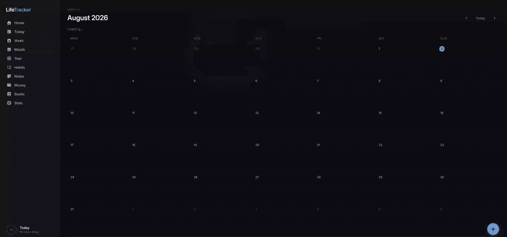
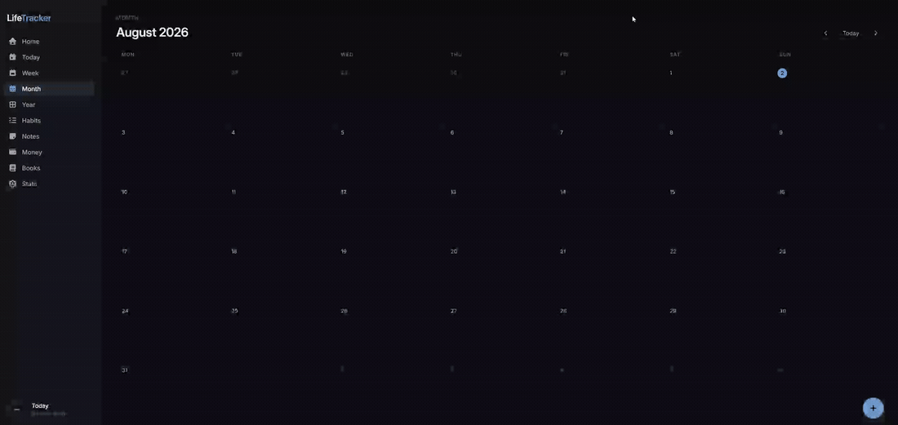

# Life Tracker

A single-user, capture-first life-tracking web app: tasks, notes, money, books, and habits, all in one dark-themed dashboard, with a lightweight RPG layer that turns "did I actually do the things" into levels, streaks, and achievements.

This is the **frontend** (Next.js). The API and persistence layer lives in a separate repo.

---

## Contents

- [Repositories](#repositories)
- [Why this exists](#why-this-exists)
- [Features](#features)
- [Demos](#demos)
- [Tech stack](#tech-stack)
- [Project structure](#project-structure)

---

## Repositories

Life Tracker is split across two repos. This is the frontend; the API lives in the other one.

| Repo | What it is |
|---|---|
| [life-tracker](https://github.com/ChrApostolidis/life-tracker) | This repo. Next.js frontend, every screen and the RPG engine |
| [life-tracker-api](https://github.com/ChrApostolidis/life-tracker-api) | Spring Boot + SQLite, the REST API and all persistence |

---

## Why this exists

I kept splitting my life across a todo app, a notes app, a budgeting app, a Goodreads-adjacent spreadsheet, and a mental tally of habits I was pretending to keep, and none of them talked to each other or made the data feel like *mine*. This app is the alternative: one place, one data model, one look, built around two ideas:

- **Capture-first**: getting a thought out of your head should take one keystroke (`Cmd/Ctrl+K`) or one sentence spoken into a mic, not a form.
- **Time-aware**: the same underlying data (tasks, money, habits) is just viewed through a different lens at Day / Week / Month / Year zoom, instead of each screen owning its own siloed logic.

The RPG layer (`/stats`, with levels, XP, streaks, attributes, achievements) exists because plain analytics dashboards are boring to open voluntarily. Turning "3-day streak" into something that visibly levels up a character made me actually want to check the app.

---

## Features

- **Today / Week / Month / Year** views over the same task data, each with its own layout (timeline, 7-column grid, month calendar, year-in-pixels heatmap)
- **Quick-capture** (`Cmd/Ctrl+K`) and **voice capture** (Web Speech API, English + Greek): speak or type, confirm the parsed fields, done
- **Recurring tasks** (daily / weekly / monthly), expanded entirely server-side
- **Inbox** for anything captured without a date, with schedule/expand/discard shortcuts
- **Notes**: a standalone note stream, plus per-book "thoughts" entries
- **Money log**: expense/income tracking with a piggy-bank balance, category breakdowns, and a 30-day spend strip (parses Greek decimal input like `3,50`)
- **Book library**: search via Open Library (no API key), a wishlist → owned → reading → finished pipeline with auto-stamped start/finish dates
- **Movie & series tracker**: search via TMDB (key stays server-side, behind Next.js Route Handlers), a watchlist → watched pipeline with genre labels, plus per-episode tracking for series that auto-completes a show on its final episode
- **Habits**: binary daily checklists, checkable from Home, Today, or a dedicated `/habits` page, with a rolling streak strip
- **Day journal**: one free-form entry per day with a 1 to 5 star rating, saved on blur and folded into the reflection streak
- **Stats / RPG engine** (`src/lib/game.ts`): a pure, stateless replay of your history into XP, levels, per-domain streaks, a 4-axis attribute radar, and achievements. Nothing is stored server-side for this; it's recomputed from the same rows every other screen already shows
- **Skeleton loading**: every page draws placeholder blocks shaped like the content it's fetching, so nothing jumps when the data lands

---

## Demos

There's no hosted demo. This runs on hardware in my apartment, not the cloud, so instead of a link that might time out on you, here's what it actually does.

### Capture loop



Typing a task straight into Quick Capture.

### Voice capture



Speaking a task instead of typing it: same Quick Capture flow, voice input.

---

## Tech stack

- [Next.js](https://nextjs.org) (App Router) + TypeScript
- CSS Modules for styling
- [FontAwesome](https://fontawesome.com) for icons
- Browser [Web Speech API](https://developer.mozilla.org/en-US/docs/Web/API/Web_Speech_API) for voice capture (Chrome/Edge, secure context required)
- [Open Library](https://openlibrary.org/developers/api) for book search and covers, called client-side, no key needed
- [TMDB](https://www.themoviedb.org/) for movie and series metadata, called through Next.js Route Handlers so the key stays server-side
- Data persistence via the separate [Spring Boot + SQLite backend](https://github.com/ChrApostolidis/life-tracker-api)

---

## Project structure

```
src/
  app/            routes (App Router), one folder per screen
  app/components/ shared UI (modals, nav, DayView, etc.)
  lib/            api.ts (REST client), types.ts, date.ts, game.ts (RPG engine),
                  and one *-context.tsx per feature domain (optimistic state + rollback)
```
