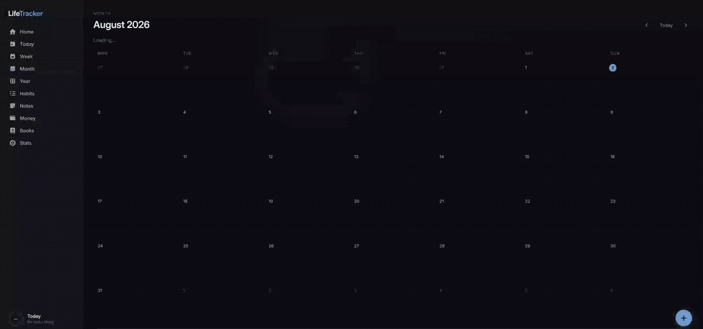
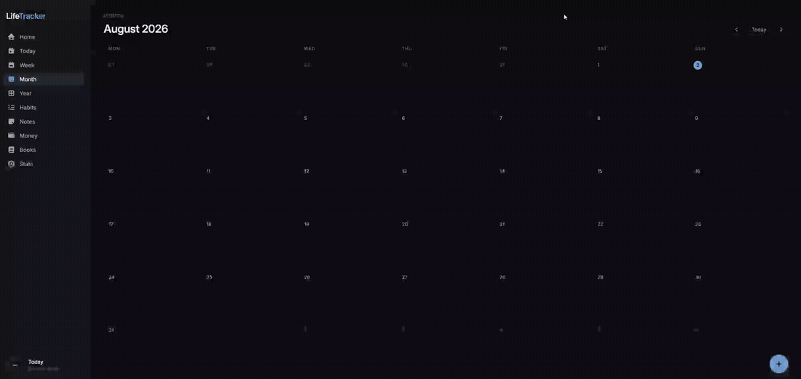

# Life Tracker

A single-user, capture-first life-tracking web app: tasks, notes, money, books, and habits, all in one dark-themed dashboard, with a lightweight RPG layer that turns "did I actually do the things" into levels, streaks, and achievements.

This is the **frontend** (Next.js). The API and persistence layer lives in a separate repo.

---

## Contents

- [Repositories](#repositories)
- [The Problem It Solves](#the-problem-it-solves)
- [Why I Built It](#why-i-built-it)
- [Design principles](#design-principles)
- [Features](#features)
- [Demos](#demos)
- [Tech stack](#tech-stack)
- [Project structure](#project-structure)

---

## Repositories

Life Tracker is split across two repos. This is the frontend; the API lives in the other one.

| Repo | What it is |
|---|---|
| [life-tracker](https://github.com/ChrApostolidis/life-tracker) | This repo. Next.js frontend, every screen and the RPG engine |
| [life-tracker-api](https://github.com/ChrApostolidis/life-tracker-api) | Spring Boot + SQLite, the REST API and all persistence |

---

## The Problem It Solves

Keeping track of your own life is spread across a handful of separate places. A to-do site in one browser tab. A notes tool in another. A spreadsheet or a budgeting site for what you spend. Somewhere online for the books you meant to read. Habits usually get nothing at all, just a vague memory of being better at them last year. Every one of them works fine on its own. Together they don't work at all.

That is the normal outcome, because each of those tools is built on the assumption that it is the only one you use. Each wants its own account and its own login, each has its own idea of what a day looks like, and each has its own place to put a thought. None of them know the others exist, so the only thing holding the pieces together is you remembering where everything went.

- **The thought is gone before the page has loaded.** Writing something down means picking the right tool, finding the tab, signing in again, and filling in a form. Most thoughts do not survive that, so they never get written down.
- **Nothing ever sees the whole day.** Your tasks, your spending and your habits all happened on the same Tuesday, but there is no single screen anywhere that can show you that Tuesday.
- **The history stops being yours.** Years of notes, purchases and finished books sit inside five different companies' accounts, in five different shapes, behind five sets of export buttons. Getting any of it back out is a project of its own.
- **Tracking is work with no payoff.** Logging things is a daily chore and the reward is a dashboard nobody opens voluntarily, so eventually the logging quietly stops.

Life Tracker is the one place instead. It opens in a browser, on a laptop or a phone, and anything you want to record goes in through the same shortcut or the same spoken sentence, in seconds, without choosing where it belongs first. Once it's in, the same day can be read as a timeline, a week, a month or a whole year at a glance, because every screen is a different view of one shared history rather than a different product. Tasks, money, habits, books, films and journal entries all sit together, so the question "what was I actually doing in March" has an answer. And because everything you log feeds a running score, with levels, streaks and milestones to unlock, keeping it up to date becomes something you want to do rather than something you owe.

---

## Why I Built It

I built this for exactly one person: me. That is a deliberate choice and not a limitation I forgot about. Because there is only ever one user, I could make decisions that a real product could not, and I would rather be honest about that than dress it up as a startup.

The idea came from a rule I set for myself. Every time I caught myself about to sign up for yet another site or install yet another tool for some corner of my life, I would build it as a section of this one instead. That is where the money log came from, and the book shelf, the habit checklist, the film and series tracker, and the journal. It grew the way my actual needs did, one refusal to open another account at a time.

It turned out to be a good project for two reasons. First, I use it every day, so I find out within a week when a decision was wrong, which is a much better teacher than a tutorial whose result I would never open again. Second, it is more involved than it looks from the outside: several different kinds of information, four different time scales over the same data, repeating events, a score calculated from your whole history, and every screen needing to work just as well in a phone browser as on a laptop.

These are the things I set out to get better at:

- **Designing the information and the rules behind it myself.** I decided what a task, a habit, a note and a purchase actually are, how one repeating task turns into all the days it shows up on, and what should happen when something is deleted and later wanted back. Nobody handed me those answers.
- **Building and running the whole thing end to end.** The screens, the part that stores everything, and the database underneath are all mine, and so is every decision about how they talk to each other. When something breaks there is nobody else's layer to blame it on.
- **Hosting it myself, on my own hardware.** It runs on a small machine in my apartment rather than a paid service, which meant setting that up, keeping it running, and being able to reach it from my phone without leaving it open to the whole internet.

It went from an empty folder to something I open every morning, and I can explain why every part of it is the way it is.

---

## Design principles

Two ideas shape every screen, and they are why this is one app instead of five:

- **Capture-first**: getting a thought out of your head should take one keystroke (`Cmd/Ctrl+K`) or one sentence spoken into a mic, not a form.
- **Time-aware**: the same underlying data (tasks, money, habits) is just viewed through a different lens at Day / Week / Month / Year zoom, instead of each screen owning its own siloed logic.

The RPG layer (`/stats`, with levels, XP, streaks, attributes, achievements) exists because plain analytics dashboards are boring to open voluntarily. Turning "3-day streak" into something that visibly levels up a character made me actually want to check the app.

---

## Features

- **Today / Week / Month / Year** views over the same task data, each with its own layout (timeline, 7-column grid, month calendar, year-in-pixels heatmap)
- **Quick-capture** (`Cmd/Ctrl+K`) and **voice capture** (Web Speech API, English + Greek): speak or type, confirm the parsed fields, done
- **Recurring tasks** (daily / weekly / monthly), expanded entirely server-side
- **Inbox** for anything captured without a date, with schedule/expand/discard shortcuts
- **Notes**: a standalone note stream, plus per-book "thoughts" entries
- **Money log**: expense/income tracking with a piggy-bank balance, category breakdowns, and a 30-day spend strip (parses Greek decimal input like `3,50`)
- **Book library**: search via Open Library (no API key), a wishlist → owned → reading → finished pipeline with auto-stamped start/finish dates
- **Movie & series tracker**: search via TMDB (key stays server-side, behind Next.js Route Handlers), a watchlist → watched pipeline with genre labels, plus per-episode tracking for series that auto-completes a show on its final episode
- **Habits**: binary daily checklists, checkable from Home, Today, or a dedicated `/habits` page, with a rolling streak strip
- **Day journal**: one free-form entry per day with a 1 to 5 star rating, saved on blur and folded into the reflection streak
- **Journal**: one browsable timeline over both the daily logs and longer tagged entries, with filter chips, search and a month jumper, so nothing written ever gets lost
- **Stats / RPG engine** (`src/lib/game.ts`): a pure, stateless replay of your history into XP, levels, per-domain streaks, a 4-axis attribute radar, and achievements. Nothing is stored server-side for this; it's recomputed from the same rows every other screen already shows
- **Skeleton loading**: every page draws placeholder blocks shaped like the content it's fetching, so nothing jumps when the data lands

---

## Demos

There's no hosted demo. This runs on hardware in my apartment, not the cloud, so instead of a link that might time out on you, here's what it actually does.

### Capture loop



Typing a task straight into Quick Capture.

### Voice capture



Speaking a task instead of typing it: same Quick Capture flow, voice input.

---

## Tech stack

- [Next.js](https://nextjs.org) (App Router) + TypeScript
- CSS Modules for styling
- [FontAwesome](https://fontawesome.com) for icons
- Browser [Web Speech API](https://developer.mozilla.org/en-US/docs/Web/API/Web_Speech_API) for voice capture (Chrome/Edge, secure context required)
- [Open Library](https://openlibrary.org/developers/api) for book search and covers, called client-side, no key needed
- [TMDB](https://www.themoviedb.org/) for movie and series metadata, called through Next.js Route Handlers so the key stays server-side
- Data persistence via the separate [Spring Boot + SQLite backend](https://github.com/ChrApostolidis/life-tracker-api)

---

## Project structure

```
src/
  app/            routes (App Router), one folder per screen
  app/components/ shared UI (modals, nav, DayView, etc.)
  lib/            api.ts (REST client), types.ts, date.ts, game.ts (RPG engine),
                  and one *-context.tsx per feature domain (optimistic state + rollback)
```
